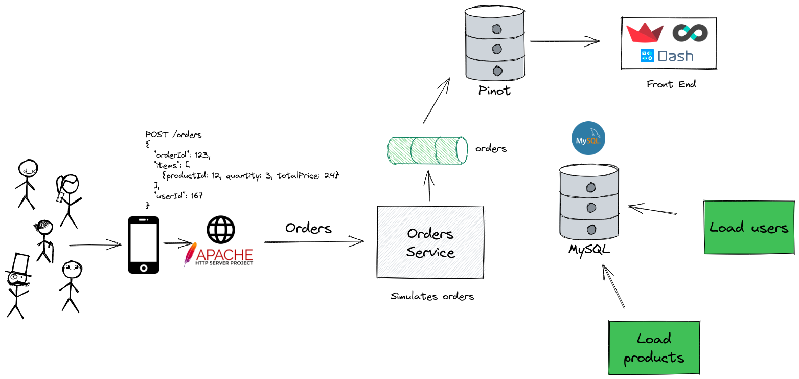

# Pizza Shop Demo

This repository contains the code for the Pizza Shop Demo, showcasing a real-time analytics application using Apache Pinot.

## Prerequisites

- [Docker Desktop](https://www.docker.com/products/docker-desktop): Ensure Docker Desktop is installed and running on your machine before starting the demo.



## How to Run the Demo

To start the demo, execute the following command in your terminal:

```bash
make
```

After the demo is up and running, you can access the following interfaces in your web browser:

- **Pinot UI:** [http://localhost:9000](http://localhost:9000)
- **Streamlit Dashboard:** [http://localhost:8502](http://localhost:8502)

For a detailed explanation of each component in the demo, visit the [documentation page](https://dev.startree.ai/docs/pinot/demo-apps/pizza-shop).

## Common Issues

Occasionally, the `pinot-add-table` service may not return a success code (0) if it creates one table but fails to create the other.
To resolve this issue, you can manually stop the service by running:

```bash
docker stop pinot-add-table
```

## Stopping the Demo

To stop all the services and clean up the resources used by the demo, run:

```bash
make stop
```
